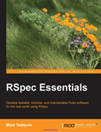

```
Roberto Nogueira  BSd EE, MSd CE
Solution Integrator Experienced - Certified by Ericsson
```

# RSpec Essentials



## Table of Contents

```
Table of Contents

[ ] 1: EXPLORING TESTABILITY FROM UNIT TESTS TO BEHAVIOR-DRIVEN DEVELOPMENT
[ ] 2: SPECIFYING BEHAVIOR WITH EXAMPLES AND MATCHERS
[ ] 3: TAKING CONTROL OF STATE WITH DOUBLES AND HOOKS
[ ] 4: SETTING UP AND CLEANING UP
[ ] 5: SIMULATING EXTERNAL SERVICES
[ ] 6: DRIVING A WEB BROWSER WITH CAPYBARA
[ ] 7: BUILDING AN APP FROM THE OUTSIDE IN WITH BEHAVIOR-DRIVEN DEVELOPMENT
[ ] 8: TACKLING THE CHALLENGES OF END-TO-END TESTING
[ ] 9: CONFIGURABILITY
[ ] 10: ODDS AND ENDS
```
